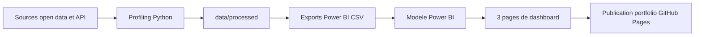

# Analyse Mobilite Rhone


## Pitch

Ce projet analyse le potentiel de mobilite dans le Rhone et la Metropole de Lyon a partir de donnees ouvertes.

L'objectif est de produire une lecture operationnelle du territoire : reperer les zones ou les deplacements se concentrent, identifier les horaires de tension, evaluer les secteurs prioritaires et estimer un revenu theorique a partir des trajets observes.

En l'absence de donnees commerciales ouvertes suffisamment detaillees, j'ai reconstruit une lecture exploitable du territoire a partir de sources publiques : trajets de covoiturage, comptages, stations taxi, chantiers, meteo, geocodage et tarifs publics 2026.

## Problematique

**Comment transformer des donnees ouvertes de mobilite en outil d'aide a la decision pour identifier les zones, periodes et conditions favorables au deploiement d'une offre de transport dans le Rhone ?**

## Periode analysee

J'ai retenu le trimestre **janvier-mars 2026**.

Ce choix permet de travailler sur une periode recente, complete et comparable entre mois. Les donnees recentes ne sont pas supposees propres par defaut : elles ont ete controlees avant d'etre integrees au modele.

## Sources retenues

| Source | Utilisation dans le projet |
|---|---|
| Registre de Preuve de Covoiturage | Base centrale des trajets individuels |
| Comptages de mobilite Grand Lyon | Intensite de circulation par capteur et par tranche horaire |
| Stations taxi Grand Lyon | Offre taxi stationnaire et couverture du territoire |
| Chantiers perturbants Grand Lyon | Contexte routier et perturbations |
| Meteo-France | Contexte meteo quotidien |
| Tarifs publics 2026 | Estimation theorique du revenu par trajet |
| Geocodage Azure Maps | Enrichissement de secteurs geographiques lisibles |

## Methode

Le travail a ete organise en trois temps.

1. **Profiling des donnees brutes**
   J'ai analyse les fichiers et API sources pour mesurer les lignes, colonnes, valeurs vides, NA, doublons, cles potentielles et champs exploitables.

2. **Construction des tables Power BI**
   J'ai transforme les donnees avec Python pour obtenir un schema en constellation : plusieurs tables de faits, des dimensions propres et des cles techniques adaptees a Power BI.

3. **Enrichissements metier**
   J'ai ajoute des colonnes utiles pour l'analyse : tranches horaires, jours de semaine, semaine du mois, typologie semaine/week-end, estimation tarifaire et secteurs geographiques issus des coordonnees.

Scripts principaux :

```bash
python scripts/profile_datasets.py
python scripts/build_powerbi_exports.py
python scripts/analyse_powerbi_ready.py
```

## Modele analytique

Le modele Power BI suit une logique de constellation :

- aucune relation directe fact-to-fact ;
- aucune relation directe dimension-to-dimension ;
- relations de type dimension `1` vers table de faits `*` ;
- conservation du detail dans les facts ;
- dimensions dediees aux dates, communes, tranches horaires, sites, stations, chantiers, tarifs et secteurs.



## Tables principales

| Table | Role | Volume |
|---|---|---:|
| `fact_trajets.csv` | Trajets detailles, base principale de l'analyse | 74 795 lignes |
| `fact_comptages.csv` | Comptages horaires de mobilite | 1 360 146 lignes |
| `fact_meteo_jour.csv` | Meteo quotidienne par station | 1 620 lignes |
| `fact_stations_taxi.csv` | Stations taxi et caracteristiques | 113 lignes |
| `bridge_chantier_date_commune.csv` | Chantiers actifs par date et commune | 4 095 lignes |
| `dim_secteur.csv` | Secteurs depart/arrivee geocodes par trajet | 74 795 lignes |

## Decisions importantes

- En l'absence de donnees commerciales ouvertes suffisamment detaillees, le covoiturage est utilise comme proxy de trajets individuels.
- `journey_id` n'est pas utilise comme cle primaire stricte : une cle technique `trajet_ligne_id` conserve toutes les lignes.
- L'arrivee des trajets est estimee avec `date_heure_depart + duree_min`, car le champ source d'arrivee est identique au depart dans le RPC filtre.
- Les CSV sont prepares pour Power BI en francais : separateur `;`, decimal `,`, encodage UTF-8 avec BOM.
- Les coordonnees sont conservees en latitude/longitude separees pour les cartes Power BI.
- Le fichier `.pbix` n'est pas versionne dans GitHub ; seules les donnees preparees, scripts et documentations sont publies.

## Dashboard Power BI

Le rapport est limite a trois pages pour rester lisible dans un portfolio.

| Page | Objectif |
|---|---|
| Vue d'ensemble | KPIs, evolution mensuelle, top communes, repartition horaire |
| Demande temporelle | Heatmap jour x tranche horaire, evolution quotidienne, semaine vs week-end |
| Analyse geographique | Carte, communes, secteurs et zones prioritaires |

## Structure du depot

```text
analysis/        Resultats de profiling, dictionnaire de donnees, analyses JSON
data/processed/  Donnees filtrees ou intermediaires
data/powerbi/    Tables CSV finales chargees dans Power BI
docs/            Notes de publication, pages Power BI et identite du projet
scripts/         Scripts Python de profiling, transformation et analyse
```

## Documentation

- `documentation_obtention_datasets_retenus.md` : selection des sources et decisions de conservation.
- `documentation_etape_2_exports_powerbi.md` : transformation Python et construction du modele Power BI.
- `analysis/dictionnaire_donnees_profiling.md` : dictionnaire de donnees et controles qualite.
- `docs/powerbi_pages.md` : structure du dashboard.
- `docs/publication_github_pages.md` : strategie de publication portfolio.
